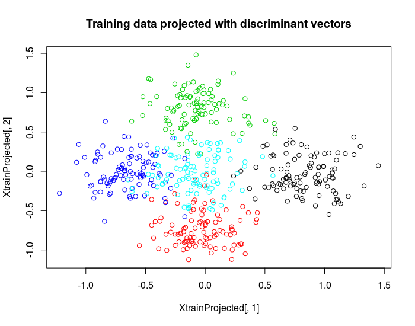

# accSDA
## Accelerated Sparse Discriminant Analysis

This is the `R`-package accompanying the paper [Proximal Methods for Sparse Optimal Scoring and Discriminant Analysis](https://arxiv.org/pdf/1705.07194.pdf).

This package is currently under development, although most of the functionality is there already! You can now do sparse discriminant analysis with the package, but the visualization tools are being implemented and tested.

# Why should you use this package?

Do you have a data set with a **lot of variables and few samples**? Do you have **labels** for the data? 

Then you might be trying to solve an *p>>n* classification task.

This package includes functions that allow you to train such a classifier in a sparse manner. In this context *sparse* means that only the best variables are selected for the final classifier. In this sense you can also interpret the output, i.e. use it to identify important variables for your classification task. The current functions also handle cross-validation for tuning the sparsity, look at the documentation for further description/examples.

# Installation

You can install the package from CRAN or for the development version, you can install directly from github.

To install directly from CRAN simply type the following into your R console:
```R
install.packages("accSDA")
```
This should be enough for most users!

To install packages from github you need the `devtools` package. So install that if you haven't gotten it already!

Now you can proceed to install the development version of the package package:
```R
library(devtools)
install_github("gumeo/accSDA")
library(accSDA)
```
And now you can start playing around with the package!

# Iris tutorial

The following is an example on how one could use the package on Fisher's Iris dataset. I choose the Iris dataset because most people are familiar with it. Check also the *p>>n* example below!

```R
# Prepare training and test set
train <- c(1:40,51:90,101:140)
Xtrain <- iris[train,1:4]

# normalize is a function in the package
nX <- normalize(Xtrain)
Xtrain <- nX$Xc
Ytrain <- iris[train,5]
Xtest <- iris[-train,1:4]
Xtest <- normalizetest(Xtest,nX)
Ytest <- iris[-train,5]
     
# Define parameters for SDAD, i.e. ADMM optimization method
# Also try the SDAP and SDAAP methods, look at the documentation
# to read more about the parameters!
Om <- diag(4)+0.1*matrix(1,4,4) #elNet coef mat
gam <- 0.01
lam <- 0.01
method <- "SDAD"
q <- 2
control <- list(PGsteps = 100,
                PGtol = c(1e-5,1e-5),
                mu = 1,
                maxits = 100,
                tol = 1e-3,
                quiet = FALSE)
     
# Run the algorithm
res <- ASDA(Xt = Xtrain,
            Yt = Ytrain,
            Om = Om,
            gam = gam ,
            lam = lam,
            q = q,
            method = method,
            control = control)
     
# Can also just use the defaults:
# Default optimization method is SDAAP, accelerated proximal gradient.
resDef <- ASDA(Xtrain,Ytrain)
```
Now that you have gotten some results, you want to test the performance on the test set! What comes out of the `ASDA` function is an S3 object of class `ASDA` and there is a predict method in the package to predict the outcome of the classifier on new data!

```R
preds <- predict(res, newdata = Xtest)
```

# A larger example

The Iris data is not very convincing, so let's take a look at a simulated example that is more relevant w.r.t. sparsity.

The goal here is to demonstrate how we setup the data, how we normalize, train, predict, plot projected data and assess accuracy.

Try running the following code in an R-session with `accSDA` loaded.

```R
# You can play around with these parameters
P <- 300 # Number of variables
N <- 100 # Number of samples per class
K <- 5 # Number of classes

# Mean for classes, they are zero everywhere except that coordinate i has
# value 3 for class i, each column of the means matrix represents a mean
# for a specific class.
means <- matrix(0,nrow=P,ncol=K)
for(i in 1:K){
  means[i,i] <- 5
}


# Sample dummy data
Xtrain <- matrix(0,nrow=0,ncol=P)
Xtest <- matrix(0,nrow=0,ncol=P)
for(i in 1:K){
  Xtrain <- rbind(Xtrain,MASS::mvrnorm(n=N,mu = means[,i], Sigma = diag(P)))
  Xtest <- rbind(Xtest,MASS::mvrnorm(n=N,mu = means[,i], Sigma = diag(P)))
}

# Generate the labels
Ytrain <- factor(rep(1:K,each=N))
Ytest <- Ytrain

# Normalize the data
Xt <- accSDA::normalize(Xtrain)
Xtrain <- Xt$Xc # Use the centered and scaled data
Xtest <- accSDA::normalizetest(Xtest,Xt)

# Train the classifier and increase the sparsity parameter from the default
# so we penalize more for non-sparse solutions.
res <- accSDA::ASDA(Xtrain,Ytrain,lam=0.01)

# Plot the projected training data, it is projected to the first
# 2-dimensions, this is possible because the number of discriminant
# vectors is the number of classes minus 1.
XtrainProjected <- Xtrain%*%res$beta

# Plot using the first two discriminant directions
plot(XtrainProjected[,1],XtrainProjected[,2],col=Ytrain,
     main='Training data projected with discriminant vectors')
```

```R

# Predict on the test data
preds <- predict(res, newdata = Xtest)

# Plot projected test data with predicted and correct labels
XtestProjected <- Xtest%*%res$beta

plot(XtestProjected[,1],XtestProjected[,2],col=Ytest,
     main="Projected test data with original labels")
plot(XtestProjected[,1],XtestProjected[,2],col=preds$class,
     main="Projected test data with predicted labels")

# Calculate accuracy
sum(preds$class == Ytest)/(K*N) # We have N samples per class, so total K*N

# Inspect the res$beta vector to see that the discriminant vector is sparse
```

# Future plans

Coming releases will include more plotting and printing functionality for the `ASDA` objects. A C++ backend is also in the pipeline along with some further extensions to handle different types of data.
